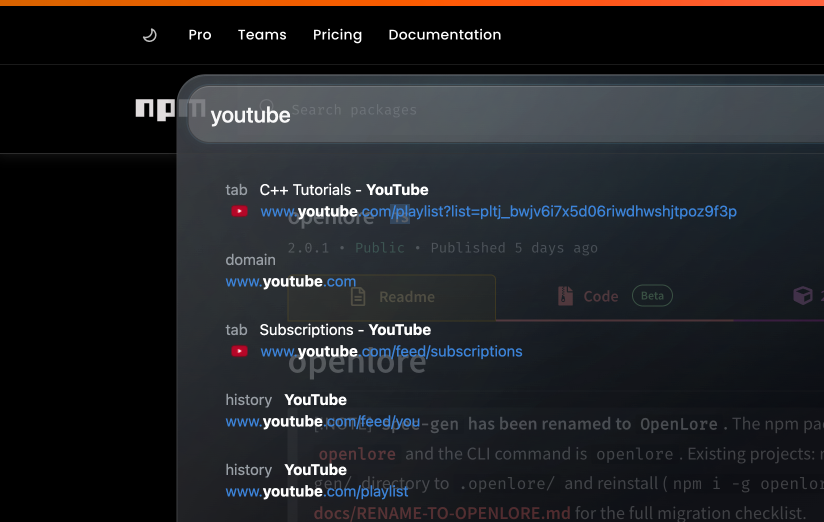
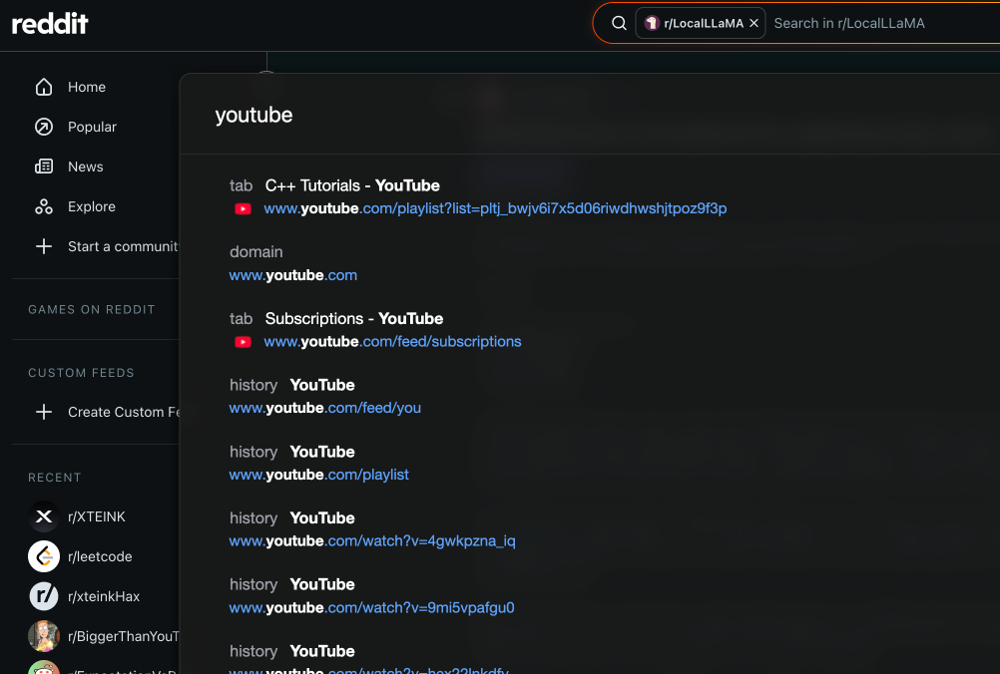
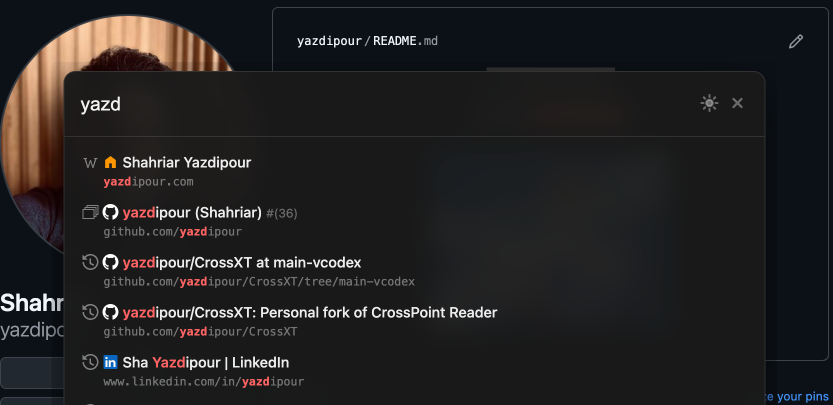

# vimium-theme

I made some themes for vimium to make it more like home. I hope you like it.

## VisionOS Inspired Theme

[style.css](./visionos/style.css)

## Raycast Inspired Theme

[style.css](./raycast/style.css)

## Vimium-C Raycast Theme

[style.css](./vimium-c-raycast/style.css)

